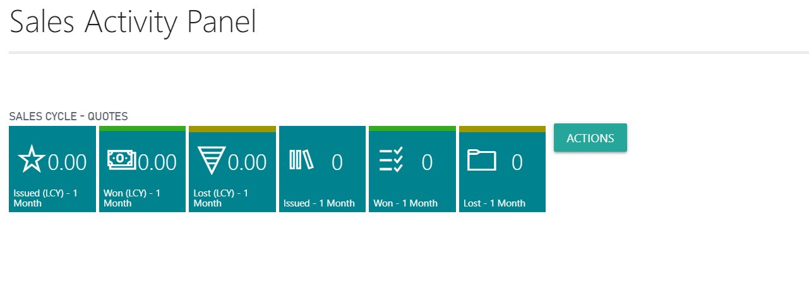
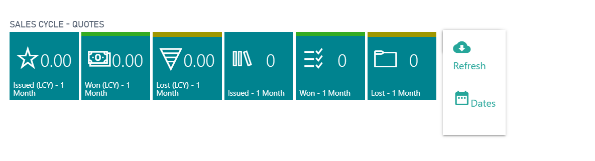

# Dynamics NAV Business Central Dropdown Actionbutton ControlAddIn
A Javascript/css dropdown action button for Dynamics Business Central

As Control Actions are removed from the Cuegroups in BC365, I decided to create a simple dropdown button with help of https://materializecss.com/

Before

After

How to use:
1. Copy contents of ActionMenu folder into your VS Code ControlAddIn folder
2. Add usercontrol into your B365 page and enjoy.

Full guide to create dropdown button @ https://materializecss.com/dropdown.html
